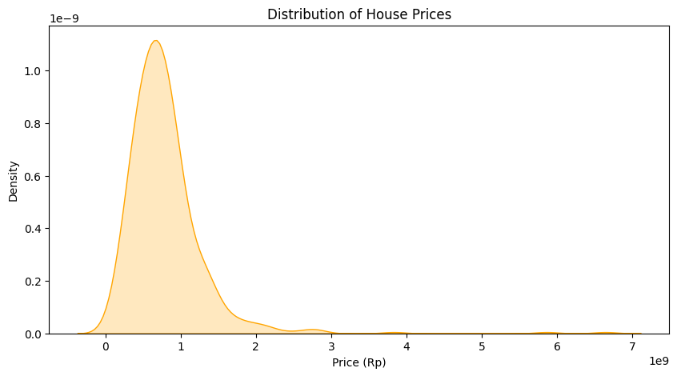
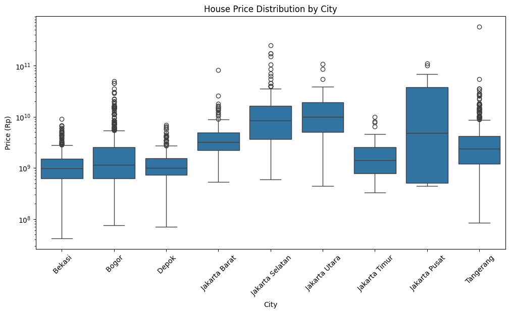
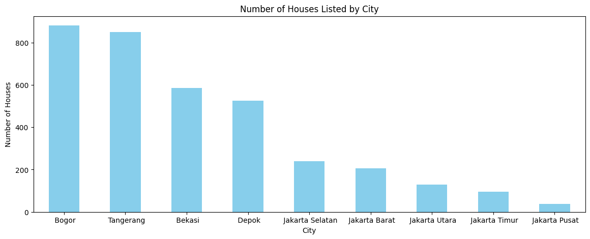
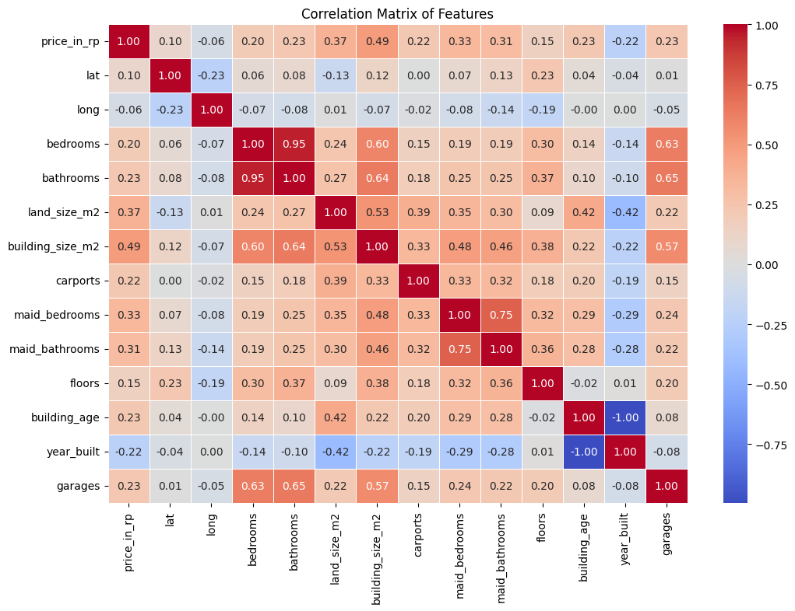
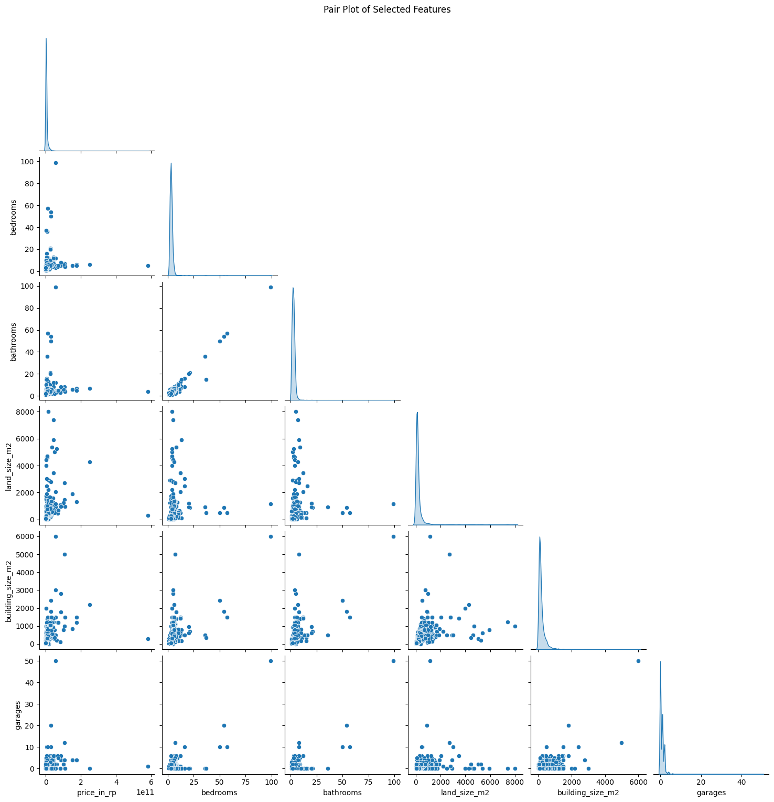
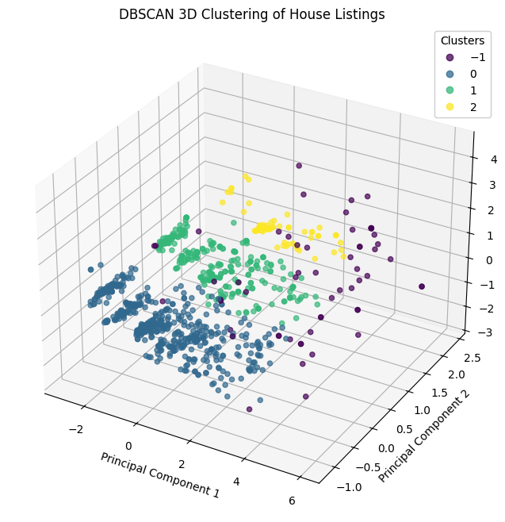
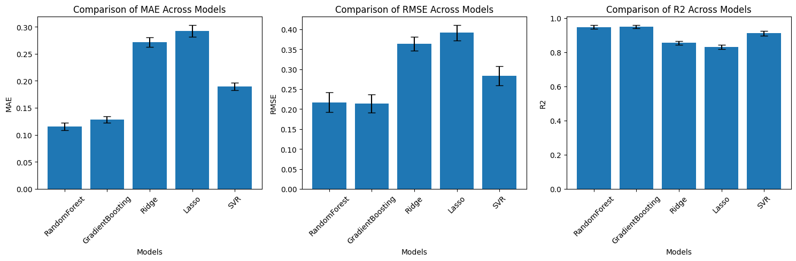
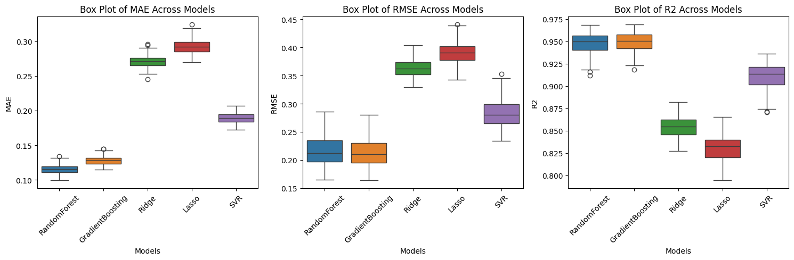

# Jabodetabek House Price Regression

## Overview
This project aims to predict house prices in the Jabodetabek area (Jakarta, Bogor, Depok, Tangerang, Bekasi) using machine learning regression techniques. The dataset, sourced from [Kaggle](https://www.kaggle.com/datasets/nafisbarizki/daftar-harga-rumah-jabodetabek), contains various property features such as price, city, bedrooms, bathrooms, land size, building size, and more. The goal is to build robust models that can accurately estimate house prices and provide insights into the factors influencing property values in this region.

## Project Workflow
1. **Data Import & Exploration**
   - The dataset is loaded and basic statistics are explored.
   - Checks for missing values, duplicates, and outliers are performed.
   - Visualizations include price distributions, city-wise price analysis, and feature correlations.

2. **Data Preprocessing**
   - Irrelevant features are removed.
   - Missing values are handled using KNN imputation for numerical columns and mode imputation for categorical columns.
   - Outliers are clipped using the IQR method.
   - Categorical features are encoded using one-hot, ordinal, and target encoding as appropriate.

3. **Clustering Analysis**
   - DBSCAN clustering is applied to identify natural groupings in the data.
   - PCA is used for 3D visualization of clusters, revealing three main property segments and a noise group (outliers).

4. **Model Training & Evaluation**
   - Five regression models are trained: Random Forest, Gradient Boosting, Ridge, Lasso, and SVR.
   - Hyperparameter tuning is performed using GridSearchCV.
   - Each model is evaluated over 100 random train-test splits for robust performance estimation.
   - Metrics used: MAE (Mean Absolute Error), RMSE (Root Mean Squared Error), and R² (Coefficient of Determination).

## EDA Visualizations

### Distribution of House Prices

### House Price Distribution by City

### Number of Houses per City

### Correlation Matrix

### Pair Plot of Selected Features

### Cluster Analysis (DBSCAN 3D)

## Modeling Visualizations

### Model Performance Comparison (Bar Chart)

### Model Performance Comparison (Box Plot)

*Note: To view these visualizations, run the notebook and the plots will be generated in the output cells. You can also save the figures as images to the `figs/` directory for inclusion in this README.*

## Results & Analysis
- **Random Forest** and **Gradient Boosting** models achieved the best results, with mean MAE values of 0.115 and 0.128, and RMSE values of 0.216 and 0.213, respectively. Both models had high R² scores above 0.94, indicating strong predictive power and stability.
- **SVR** performed moderately well, with an average MAE of 0.189 and RMSE of 0.283, and R² around 0.91.
- **Ridge** and **Lasso** regression models had higher errors and lower R² values (0.85 and 0.83), making them less suitable for this task.
- The clustering analysis revealed three main property segments, likely corresponding to affordable, mid-range, and premium/luxury properties, with a separate group for outliers.

## Conclusion
- Tree-based models (Random Forest, Gradient Boosting) are the most reliable for predicting house prices in Jabodetabek.
- Feature engineering and robust preprocessing are crucial for model performance.
- The market shows clear segmentation, which can be leveraged for targeted pricing strategies.
- Future work can focus on further feature selection, advanced hyperparameter tuning, and incorporating additional data sources for improved accuracy.

---

*Made by Reyhan Zada Virgiwibowo*
